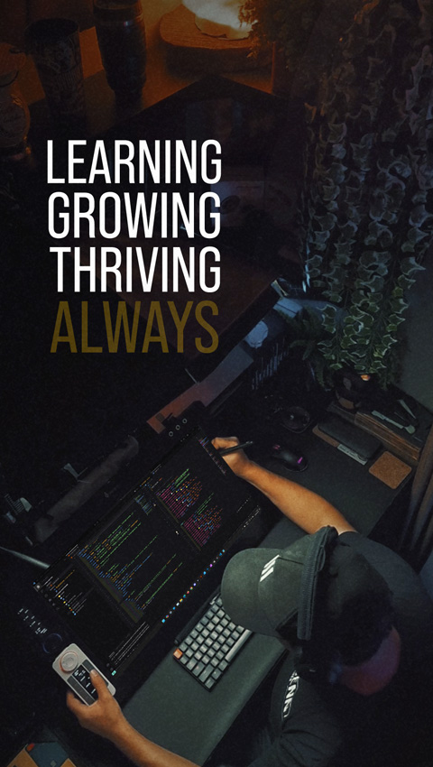

<h1 align="left">Hi , I'm Tales Henn</h1>
<h4> Graphic Designer & Retoucher | Aspiring Web Developer </h4>

- 💬 I'm currently working as a **freelance retoucher and graphic designer** while studying programming.  
  My [Retouch Portfolio](https://taleshenn.com.br/) in case you are curious.

- 🔥 Yes, I am expanding skills into Web development ♥.
  While still in the learning process, **I'm already able** to build small front-end projects emphasizing UI and pure HTML and CSS.

- 🔭 Do you have an opportunity for me? Trust me, I possess a wide range of skills. Don't let my status as a programming learner mislead you.  
  ⚡**Photoshop, Illustrator, In Design Lightroom, Adobe Express, Premiere Pro**
   
  ⚡**Product and People Photographer, High end Retoucher**
   
- ▶️ Fun fact: I used to make [YouTube videos](https://youtube.com/taleshenn) about **image retouching**.

- 📫 How to reach me? contato@taleshenn.com.br
